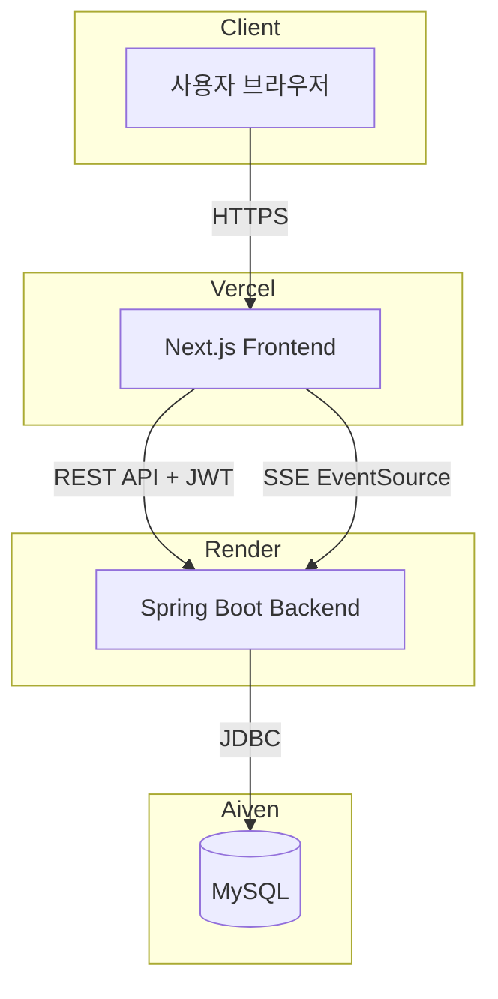
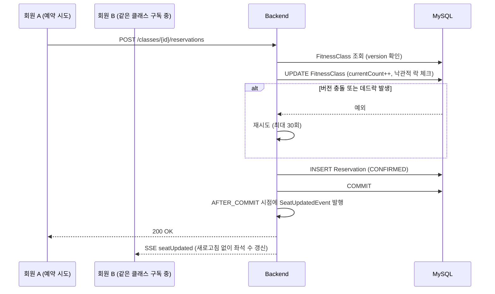
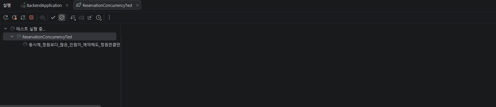

# PT팟 — Frontend

그룹 PT 클래스 예약 시스템의 백엔드입니다. **동시 요청 상황에서 데이터 정합성을 지키는 것**과 **실시간으로 상태 변화를 클라이언트에 전달하는 것**, 이 두 가지에 집중해서 만들었습니다.

- 🔗 **Live API**: https://pt-reservation-backend.onrender.com
- 📘 **API 문서 (Swagger)**: https://pt-reservation-backend.onrender.com/swagger-ui/index.html
- 🖥 **프론트엔드 저장소**: [pt-reservation-frontend](https://github.com/PT-reservation/pt-reservation-frontend)

> 무료 플랜(Render)이라 15분 이상 요청이 없으면 서버가 슬립 상태로 전환됩니다. 첫 요청은 최대 1분 정도 걸릴 수 있습니다.

---

## 아키텍처



---

## 이 프로젝트가 증명하는 것

### 1. 낙관적 락(Optimistic Lock)으로 동시성 제어

정원이 있는 클래스에 여러 명이 동시에 예약을 시도해도, 정원을 초과해서 확정시키지 않아야 합니다. `FitnessClass` 엔티티에 `@Version` 컬럼을 두고, 예약 처리 중 다른 트랜잭션이 먼저 커밋되면 낙관적 락 예외가 발생하도록 설계했습니다.

트랜잭션 커밋 시점(메서드 종료 후 flush)과 Spring AOP 프록시의 자기 호출(self-invocation) 문제 때문에, **재시도 로직과 트랜잭션 로직을 별도 클래스로 분리**했습니다.

### 2. JUnit으로 강제 재현한 동시성 테스트, 그리고 실제로 발견한 MySQL 데드락

`CountDownLatch`로 여러 스레드를 완전히 동시에 출발시켜 경합 상황을 강제로 재현하는 테스트([`ReservationConcurrencyTest`](src/test/java/com/ptreservation/backend/ReservationConcurrencyTest.java))를 작성했습니다. 정원 5명 클래스에 20명이 동시에 예약을 시도해, 정확히 5명만 확정되고 15명은 대기로 처리되는지 검증합니다.

이 테스트를 처음 돌렸을 때 확정 인원이 5명이 아니라 4명이 나왔습니다. 재시도 횟수를 늘려도 (5회 → 30회) 동일하게 실패했고, Hibernate SQL 로그를 직접 찍어본 결과 원인은 낙관적 락 충돌이 아니라 **실제 MySQL InnoDB 데드락**(에러코드 1213)이었습니다.

- **원인**: `Reservation`이 `FitnessClass`를 외래키로 참조하고 있어서, 예약 INSERT 시 MySQL이 부모 행에 공유 락을 자동으로 검. 이후 커밋 시점에 같은 행에 대한 UPDATE(배타 락 필요)가 발생하면서, 여러 트랜잭션이 "공유 락 보유 중 배타 락 승격 대기" 상태로 몰려 순환 대기(데드락)가 발생
- **해결**: 정원 UPDATE(`saveAndFlush`)를 예약 INSERT보다 먼저 실행하도록 순서를 바꿔 배타 락을 먼저 선점 — 순환 대기 자체를 차단. 재시도 로직도 `ObjectOptimisticLockingFailureException`이 아닌 상위 타입 `ConcurrencyFailureException`을 잡도록 확장해 데드락도 재시도 대상에 포함
- **결과**: 20명 동시 요청 → 실패 0건, 확정 5 / 대기 15, `currentCount` 5로 정확히 일치

### 실행 화면



### 3. SSE로 실시간 반영

- 클래스 상세 페이지에서 좌석 변동이 실시간으로 반영됩니다 (`GET /classes/{id}/events`)
- 대기자가 자동 승격되면 본인에게 실시간 알림이 갑니다 (`GET /notifications/events`)
- `@TransactionalEventListener(phase = AFTER_COMMIT)`로 **트랜잭션이 실제 커밋된 이후에만** 이벤트를 발행해, 재시도 중 롤백될 수 있는 시도에 대해 잘못된 알림이 나가는 걸 방지했습니다
- 대기열 승격 시 승격 대상자의 세션권이 부족하면, 취소 요청 자체를 실패시키는 대신(제3자의 문제로 무관한 사람의 요청이 실패하는 걸 방지) 건너뛰고 다음 대기자로 넘어가면서 본인에게는 "승격 스킵" 알림을 보내는 방식으로 설계했습니다

---

## 기술 스택

| 분류 | 사용 기술 |
|---|---|
| Language / Runtime | Java 17 |
| Framework | Spring Boot 4.1.1 (Spring Web, Spring Data JPA, Spring Security) |
| DB | MySQL 8.0 (로컬: Docker / 운영: Aiven) |
| Migration | Flyway |
| Auth | JWT (jjwt) |
| Real-time | Server-Sent Events (`SseEmitter`) |
| API 문서 | springdoc-openapi (Swagger UI) |
| Build | Gradle |
| 배포 | Render (Docker 기반) |
| Test | JUnit 5, `CountDownLatch` 기반 동시성 테스트 |

## ERD

| 엔티티 | 주요 필드 |
|---|---|
| `Member` | email, password, name, role(`MEMBER`/`TRAINER`) |
| `FitnessClass` | title, trainer, classDateTime, capacity, currentCount, **version**(낙관적 락) |
| `Reservation` | member, fitnessClass, status(`CONFIRMED`/`WAITLISTED`/`CANCELLED`), reservedAt |
| `SessionTicket` | member, totalCount, remainingCount |

## API 개요

| Method | Endpoint | 권한 | 설명 |
|---|---|---|---|
| POST | `/auth/signup` | 전체 | 회원가입 |
| POST | `/auth/login` | 전체 | 로그인 (JWT 발급) |
| GET | `/classes` | 전체 | 클래스 목록 조회 |
| GET | `/classes/{id}` | 전체 | 클래스 상세 조회 |
| GET | `/classes/{id}/events` | 전체 | 좌석 변동 실시간 스트림 (SSE) |
| POST | `/classes/{id}/reservations` | MEMBER | 예약 신청 |
| DELETE | `/reservations/{id}` | MEMBER | 예약 취소 |
| GET | `/members/me` | MEMBER | 내 정보 조회 |
| GET | `/members/me/reservations` | MEMBER | 내 예약 이력 조회 |
| GET | `/members/me/ticket` | MEMBER | 내 세션권 조회 |
| POST | `/members/me/ticket/charge` | MEMBER | 세션권 충전 |
| GET | `/notifications/events` | MEMBER | 개인 알림 실시간 스트림 (SSE) |
| POST | `/trainers/me/classes` | TRAINER | 클래스 등록 |
| PUT | `/trainers/me/classes/{id}` | TRAINER | 클래스 수정 |
| DELETE | `/trainers/me/classes/{id}` | TRAINER | 클래스 삭제 |
| GET | `/trainers/me/classes` | TRAINER | 내 클래스 목록 조회 |

전체 요청/응답 스펙은 [Swagger UI](https://pt-reservation-backend.onrender.com/swagger-ui/index.html)에서 확인할 수 있습니다.

## 로컬 실행

```bash
# 1. 로컬 MySQL 실행
docker compose up -d

# 2. src/main/resources/application-local.yaml 생성 (git에 포함되지 않음, 직접 작성 필요)
# datasource.url: jdbc:mysql://localhost:3307/pt_reservation
# datasource.username / password: docker-compose.yml 참고
# jwt.secret: 임의의 32바이트 이상 문자열

# 3. 애플리케이션 실행 (local 프로필)
./gradlew bootRun --args='--spring.profiles.active=local'

# 3. 애플리케이션 실행 (local 프로필)
./gradlew bootRun --args='--spring.profiles.active=local'

> 더미 데이터가 필요하면 `seed` 프로필을 추가하세요: `./gradlew bootRun --args='--spring.profiles.active=local,seed'` (트레이너 1명, 회원 4명, 클래스 3개 자동 생성 — 이미 데이터가 있으면 스킵)

# 4. 동시성 테스트 실행
./gradlew test --tests ReservationConcurrencyTest

> 이 테스트는 자체적으로 데이터를 생성하고(@BeforeEach) 종료 후 정리합니다(@AfterEach). 로컬 개발용 더미 데이터(DataSeeder)와 완전히 격리되어 있어, 시드 데이터 유무와 무관하게 항상 동일하게 동작합니다.
```
## 알려진 제한사항
- 회원가입 시 역할(MEMBER/TRAINER)을 사용자가 직접 선택합니다. 실제 서비스라면 트레이너 권한 부여에 별도 검증/승인 절차가 필요하지만, 이 프로젝트는 포트폴리오 데모 목적상 누구나 두 역할을 쉽게 체험해볼 수 있도록 의도적으로 승인 절차를 생략했습니다.
- 대기열 우선순위 엣지케이스: 대기자 전원이 세션권 부족으로 스킵된 상태에서 신규 예약자가 빈 자리를 먼저 가져갈 수 있음 (정원 초과 같은 데이터 정합성 문제는 아니고, 우선순위 공정성 문제로 스코프상 의도적으로 보류)
- SSE 인증에 URL 쿼리 파라미터로 JWT를 전달함 (브라우저 EventSource가 커스텀 헤더를 지원하지 않는 제약 때문) — 접근 로그에 토큰이 남을 수 있어, 실무라면 SSE 전용 단기 티켓 발급 방식으로 개선했을 부분
